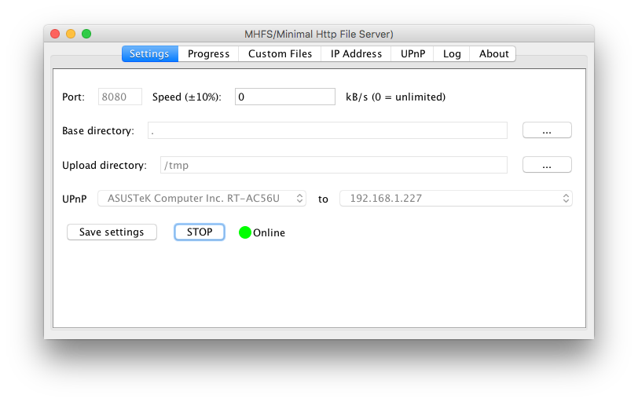

#MHFS
Minimal HTTP File Server

First written in 2006, updated and published to GitHub in 2016.

Requires a Java 8 runtime.



#Capabilities

* Rate limiting
* Choose specific files to serve
* Choose a directory to serve
* Supports uploading
* UPnP support using [Cling](https://github.com/4thline/cling/)
 * Forwards a port from your router to your computer, if you choose

#Goals

* Jar file distribution
* Simple to use
* Clean up the 10 year old code
* Either make the CLI fully featured or remove it

#Build
```bash
./gradlew fatJar
```

#Usage
Double click the built JAR file, or if you prefer to run it from the command line:
```bash
java -jar build/libs/MHFS-all-<VERSION>.jar
```
